## Entendendo a Blockchain

## O que é 

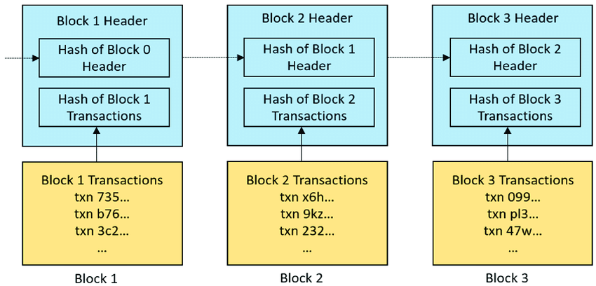

Quais são os elementos essenciais de um blockchain que possibilitam a resolução do Dilema dos Generais Bizantinos e viabilizam essa inovação? Elementos básicos dos blockchains" (from "Blockchain e Organizações Descentralizadas" by João Guilherme Lyra)

## Por que antigamente não era possivel revolver o : O problema dos generais bizantinos (PGB)

O problema dos generais bizantinos (PGB)

    - Vários generais do mesmo lado e seus exércitos estão localizados em diferentes extremos de uma cidade com a intenção de cercá-la.
    - Para ter sucesso, eles precisam atacar a cidade de maneira coordenada para derrotar as defesas ou recuar de forma coordenada. No caso de não sincronizar suas ações, eles cairão diante das fortes forças inimigas.
    - Para conseguir isso, os generais atacantes se comunicam através de mensageiros.
    - Embora a cidade esteja cheia de inimigos, os mensageiros devem atravessar a cidade para ir de um acampamento para outro com ordens de ataque.
    - A suposição indica que um mensageiro do exército informará outro da intenção de atacar ou não, e quando fazê-lo.
    - À medida que recebem propostas, os generais os confirmam ou os rejeitam para estabelecer um acordo de votação sobre qual passo dar.

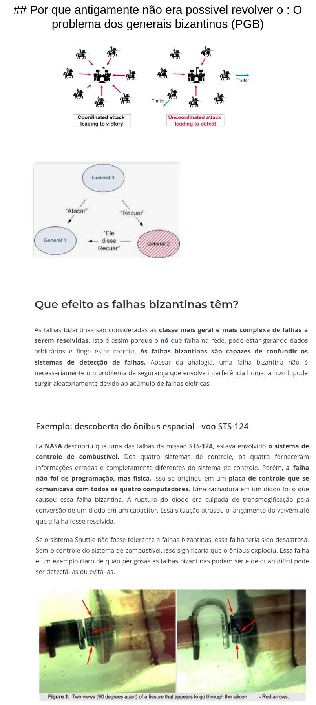

> Link de referencia: Falha Bizantina : https://academy.bit2me.com/pt/que-es-falla-bizantina/

Como você pode ver, o problema é que dentro da cidade inimigos poderiam capturar mensageiros. Se eles puderem ser interceptados, a mensagem pode ser modificado e, conseqüentemente, o ataque não seria realizado de maneira coordenada. Se não fossem executados de maneira coordenada, os exércitos atacantes seriam derrotados, fracassando em sua missão.

Por exemplo, se uma mensagem dos generais fosse "Ataque amanhã", O texto pode ser alterado adicionando" somente se chover "atrás. Desta forma, o outro exército pode pensar que está concordando em atacar apenas em caso de chuva, e confirmar a mensagem. Assim, o primeiro exército atacaria e o segundo não poderia e se retiraria se não chovesse.

Num conjunto de sistemas de computadores distribuídos com um objetivo comum, cada computador seria equivalente a um general e seu exército. E, portanto, a rede de dados seria análoga aos mensageiros que devem atravessar a cidade informando os generais.

## Elementos essenciais de um blockchain

"Mas quais são os elementos essenciais de um blockchain que possibilitam a resolução do Dilema dos Generais Bizantinos e viabilizam essa inovação? Elementos básicos dos blockchains" (from "Blockchain e Organizações Descentralizadas" by João Guilherme Lyra)

## Operadores do Banco de dados que o blockchain possui.

Operadores :
- Escrita. (READ)
- Leitura. (SELECT)
- ~Atualização (UPDATE)~
- ~Deleção (DELETE)~

Por ser um banco de dados que representa um livro razão, você não tem permissão para alterar ou deletar dados.

Caso o tente, os mecanismos da Blockchain irá barrar essa ação, pois ficará claro que você está tentando burlar o banco de dados.

## Nodos (integrantes da rede, micro servidor com todos os dados do banco)

"Rede e nodos Uma rede ponto a ponto (peer-to-peer) propaga transações e blocos para cada nó de bitcoin na rede. Existem alguns tipos de nodos em uma rede: carteira, minerador, nodo completo e roteador da rede. Todos os nodos incluem a função de roteamento para participar na rede e podem incluir outras funcionalidades (ANTONOPOULOS, 2014)." (from "Blockchain e Organizações Descentralizadas" by João Guilherme Lyra)

## Endereço ou chave pública

"Endereço ou chave pública Um endereço em um blockchain é semelhante a um e-mail, no qual se pode enviar e receber de outras pessoas as unidades de troca daquele bloco. O endereço da rede blockchain é criptografado e, ao se criar um endereço, simultaneamente é criada uma chave privada ou senha (ibid.). A interface com o endereço é realizada pelas carteiras. Um endereço de uma rede blockchain se parece com: 3JowMKcM3R3ErnNLW4XT2sjs6tGzpwRzgd" (from "Blockchain e Organizações Descentralizadas" by João Guilherme Lyra)

## Chave privada ou senha

Chave privada ou senha É a única forma de acesso para destravar os tokens e enviar para um determinado endereço. Se houver perda dessa chave, não há como mover os tokens desse endereço (ibid). Uma chave privada se parece com: 7R46xG3L6jTyzE96r66Sg3xka6y46whpJjMwCxR3tzLh3fbVOtu" (from "Blockchain e Organizações Descentralizadas" by João Guilherme Lyra)

## Token

Token Unidade de troca de uma cadeia de blocos que pode assumir diferentes funções: votos, registros, atestado, utilitário, direito de propriedade, ativos, currency e identidades (ANTONOPOULOS; WOOD, 2018). Muitas vezes um token assume mais de uma dessas funcionalidades e é chamado de híbrido." (from "Blockchain e Organizações Descentralizadas" by João Guilherme Lyra)

## Criptografia

Criptografia As informações em um blockchain só podem ser compartilhadas de forma pública graças à criptografia utilizada. A maioria das cadeias de blocos usa curvas elípticas em sua criptografia. A criptografia das transações de bitcoins utiliza o modelo de curvas elípticas, sendo assimétricas, baseadas em logaritmos discretos expressados pela adição e multiplicação nos pontos de uma curva elíptica. Essas funções matemáticas não podem ser derivadas. São funções que podem produzir novos resultados, mas não voltam ao resultado anterior. Simplificando a ideia, os cálculos só andam para frente e formam uma cadeia crescente de registros (ANTONOPOULOS, 2014)." (from "Blockchain e Organizações Descentralizadas" by João Guilherme Lyra)

## Função hash criptográfica

Função hash criptográfica Uma função hash criptográfica é uma função unidirecional que mapeia dados de tamanho arbitrário para uma cadeia de bits de tamanho fixo." (from "Blockchain e Organizações Descentralizadas" by João Guilherme Lyra)

## Timestamp 

Timestamp (carimbo de tempo) Um servidor de carimbo de tempo adiciona às hashes a hora e data, publicando amplamente a informação assim como em um jornal. O carimbo de tempo prova que os dados precisam obviamente ter existido naquele momento para que sejam incluídos na hash. Cada carimbo de tempo inclui o carimbo de tempo anterior em sua hash, formando uma corrente, com cada carimbo de tempo adicional reforçando os anteriores (NAKAMOTO, 2008).

## Distributed Ledger Technology

A tecnologia blockchain também é conhecida como DLT (Distributed Ledger Technology). Ledgers, segundo o dicionário Cambridge, é um livro no qual as coisas são registradas regularmente, especialmente atividades financeiras de dinheiro recebido ou pago. Em português, uma adequada tradução seria “livro-razão”, onde são lançadas as entradas e saídas contábeis." (from "Blockchain e Organizações Descentralizadas" by João Guilherme Lyra)

## Nodos completos 

Nodos completos podem verificar de maneira autônoma e autoritária qualquer transação sem referência externa (ANTONOPOULOS, 2014)." (from "Blockchain e Organizações Descentralizadas" by João Guilherme Lyra)

## Principal mecanismos de prevenção de falhas Bizantina

As transações que não forem reconhecidas pelos ledgers dos usuários do bloco não são válidas (MEIKLEJOHN et al., 2016). Uma vez que um nodo recebe dados de outro nodo, ele verifica a autenticação dos dados em seu próprio ledger." (from "Blockchain e Organizações Descentralizadas" by João Guilherme Lyra)

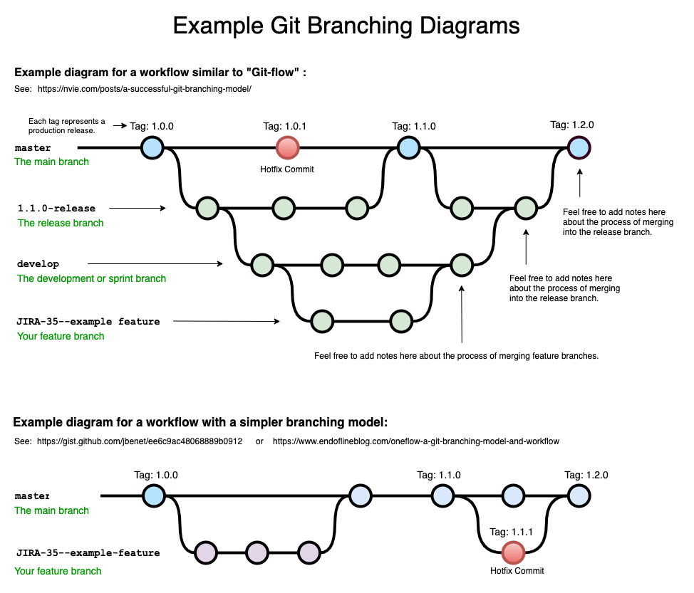

## Mapas de uma Blockchain

> Blockchain jull
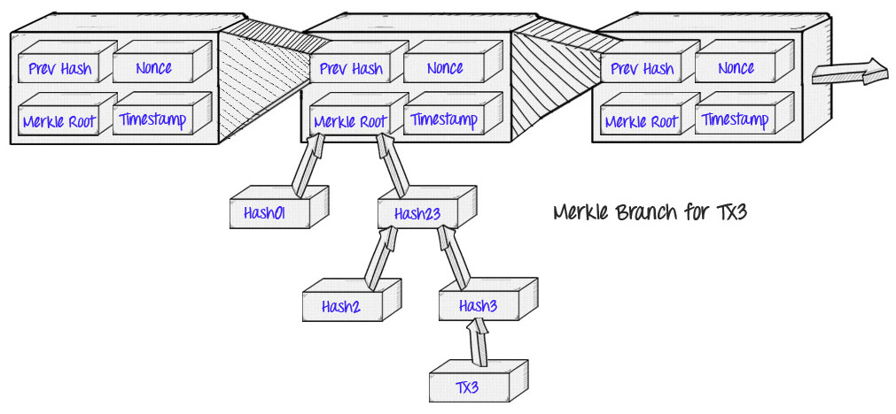

> Zoom na Merkle Tree
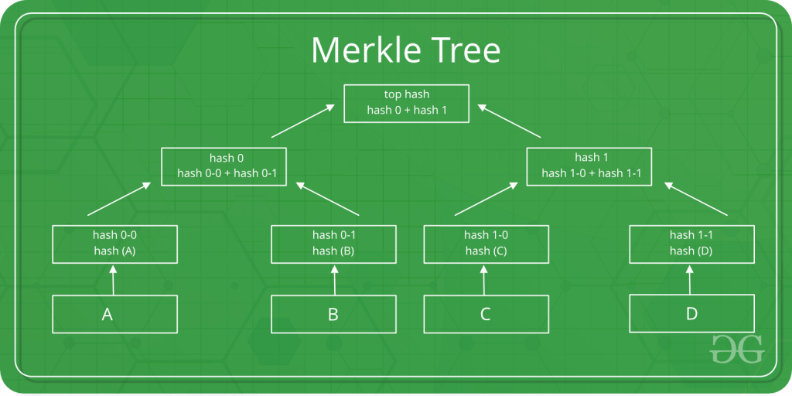

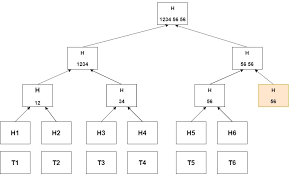
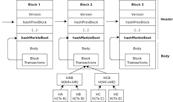
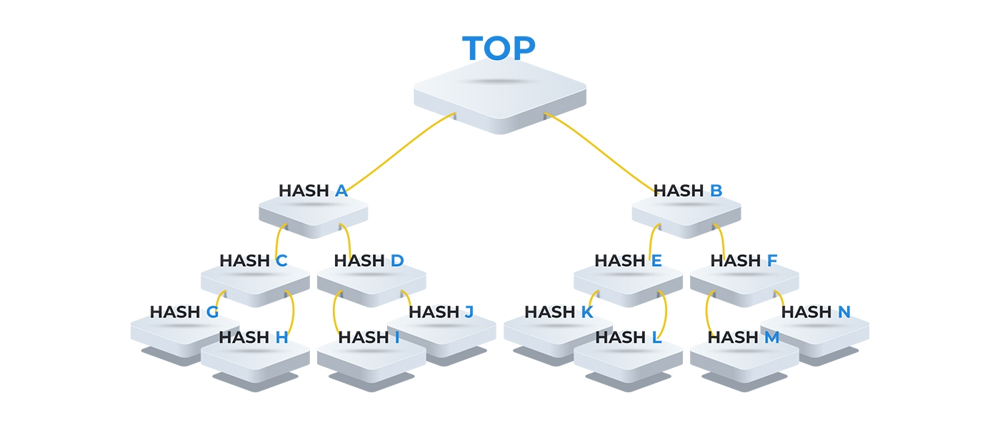

## O que é uma Merkle Tree ?

Merkel Tree é a forma que a Blockchain usa para salvar e indexar os dados, no caso o banco não precisa de um reindex pois ele já salva os dados indexados.

## Como Esse banco de dados se Indexa (semelhante a uma arvore binária)

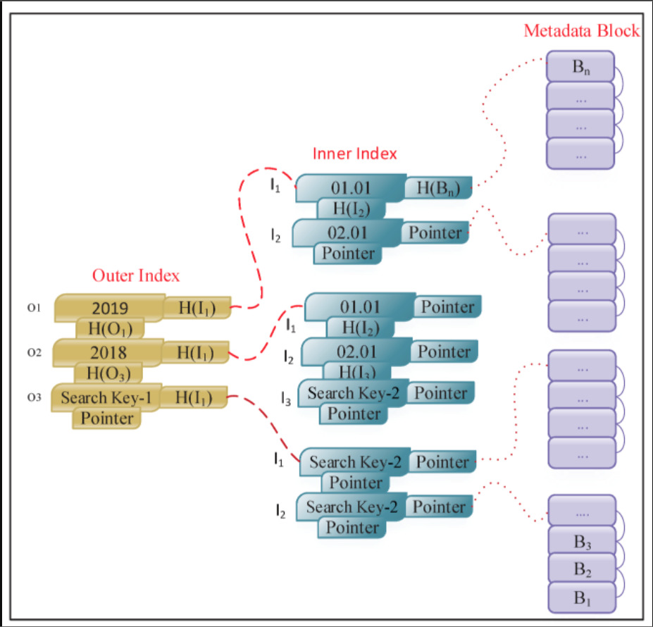

## Endereço de uma Arvore Binária

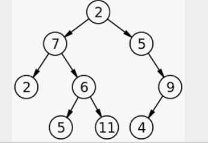

> Qual é o Endereço : 001001 ?
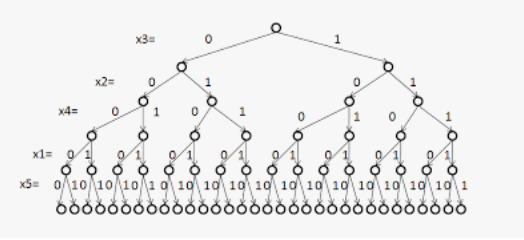

> É esse.
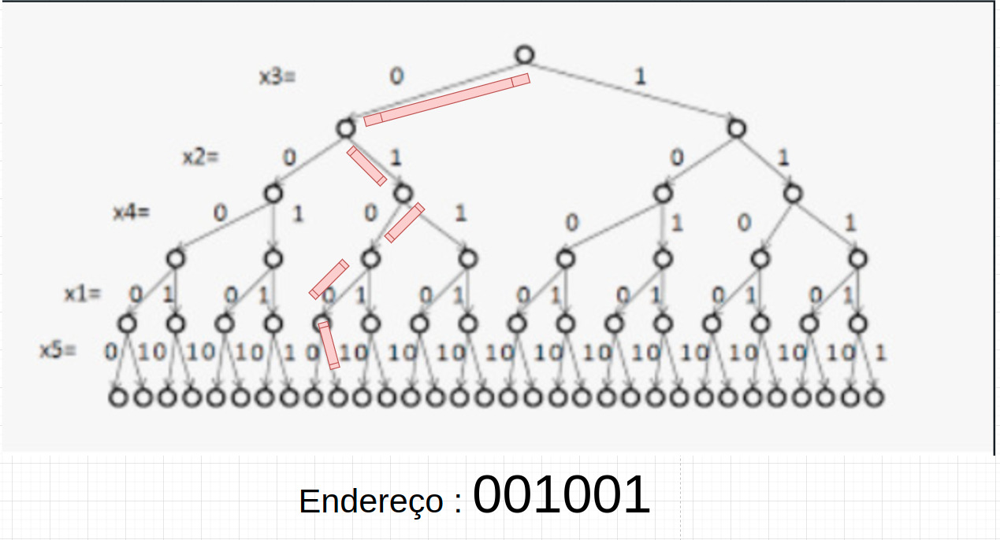