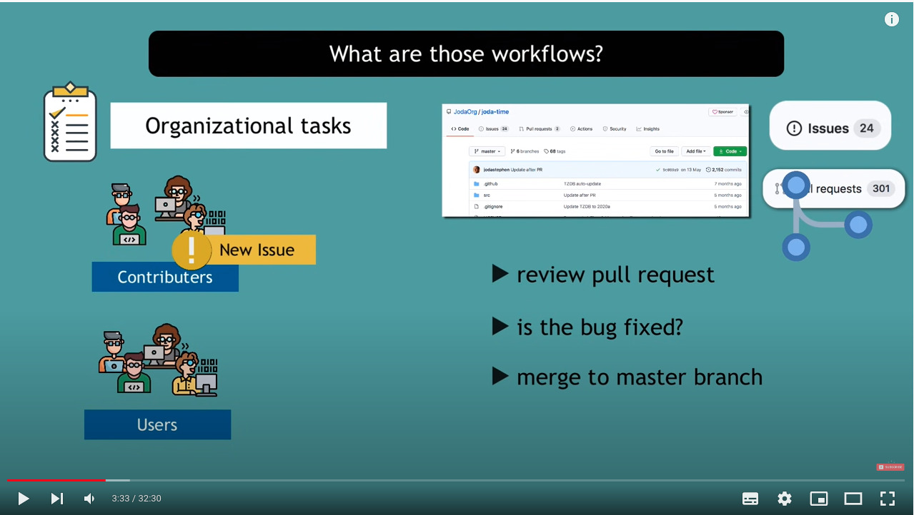
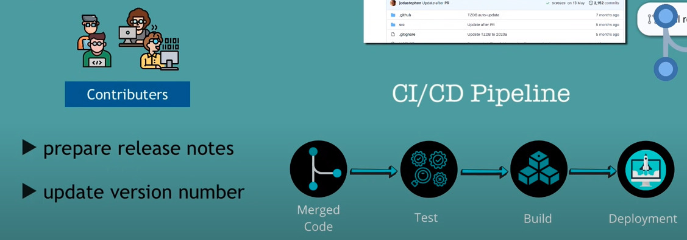
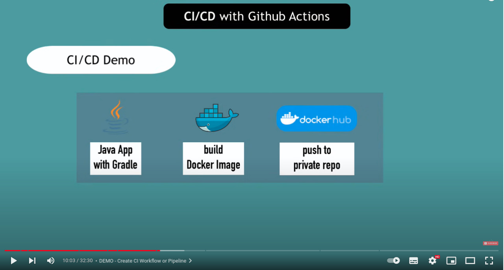
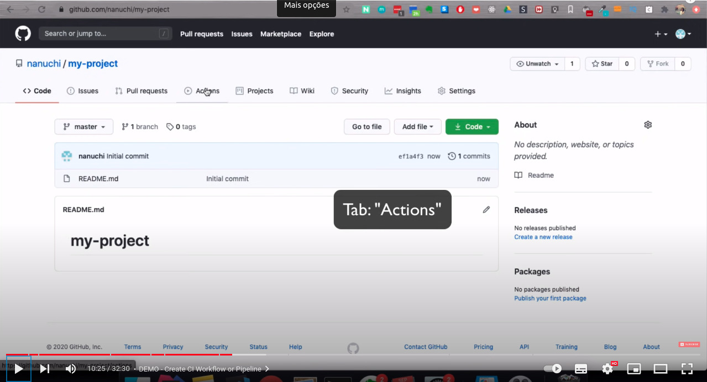

<head>
  <meta charset="utf-8">
  <meta name="Description" CONTENT="Clóvis de Barros Filho Você sabe o que é brio ??">
  <title>Clóvis de Barros Filho " Você sabe o que é brio ??"</title>
  <meta name="robots" content="all">
</head>


<picture>
  <source media="(prefers-color-scheme: dark)" srcset="https://s.dicio.com.br/brio.png">
  <source media="(prefers-color-scheme: light)" srcset="https://s.dicio.com.br/brio.png">
  
</picture>

# Clóvis de Barros Filho " Você sabe o que é brio ??"


https://g.co/kgs/vsceN5


```
Kant :

"Você pode agir mal e produzir felicidade."

e

"Agir bem e produzir tristeza"

```

> 
##  "Isso tudo é de uma potencia de argumentação **_Fudida_**"

> 
```
"A educação Pressupõe dor :

    * Pressupõe mudança de rota.

    * Advertência 

    * Tá errado !!

Se depender de feedback do aluno : Professor estaria ferrado !!"

```

> 
```
Educar muitas vezes é FALAR.

"Você é um bosta !!!!!

Você vai sofrer agora, para você aprender a ser Gente !!!!"


```

> 
## Fundamento da metafísica dos costumes.

> 
https://en.wikipedia.org/wiki/


> 
## Professor, você está me chamando de burro ?


> 
## Não ...,  ou se eu estou, Chame **me** de **Burro também**.

```
Por que é assim que **EU** Leio.
```

> 

```
[Aluno] - Mas se eu ficar toda hora voltando, eu nunca vou chegar no final da História.

[Professor] - Então ..., Desculpe, mas não tem final da 
**História** .
```

> 

```
[Professor] - Caro aluno :

* A tua inteligencia é o que você tem de melhor.

* Se ela não dará conta de entender uma FRASE, uma simples FRASE.

* Então ..... Você é um ser defecante apenas?

CARO Aluno, Você sabe o que é brio ??"

```

> 

```
Como assim, é elementar e eu não entendi ?? (ouvir isso é de moer o figado, é isso que to falando CARA...)

* É O BRIO
* É O BRIO
* É O BRIO
```

<picture>
  <source media="(prefers-color-scheme: dark)" srcset="https://s.dicio.com.br/brio.png">
  <source media="(prefers-color-scheme: light)" srcset="https://s.dicio.com.br/brio.png">
  
</picture>

# Esse Brio que vai fazer você Progredir intelectualmente.

## Referências

> 
https://www.youtube.com/watch?v=UVtgFN3K6kE

> # CI/CD Git Hub 
  
* 
https://youtu.be/R8_veQiYBjI

* 

* 

* 

* 

* 

* 

* 

* 

* 

* 

> 
https://www.youtube.com/channel/UCIvdVpHdlokxz_wArsoLnVA/videos

> 
https://en.wikipedia.org/wiki/Groundwork_of_the_Metaphysics_of_Morals


> 
https://espacoetica.com.br/palestrantes/?cupom=GOVIN


