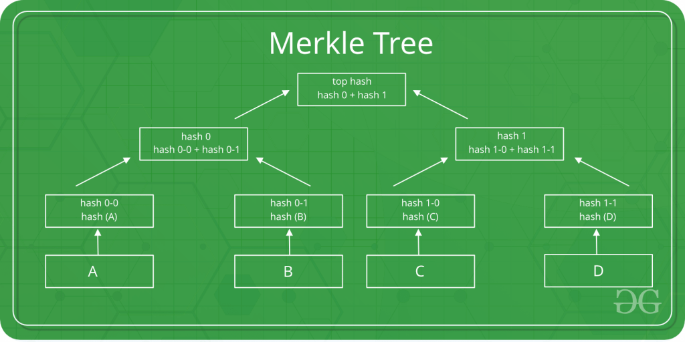
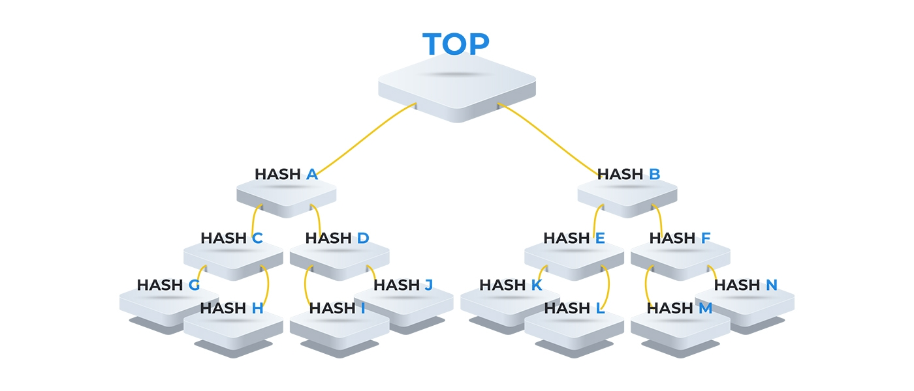
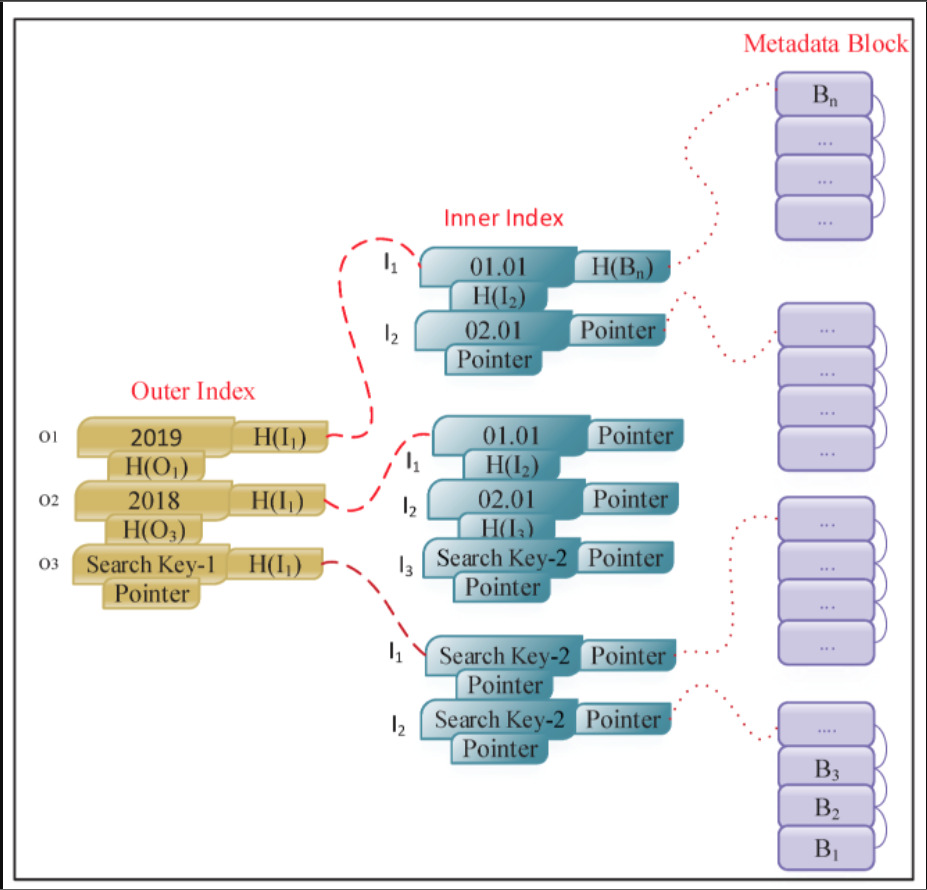
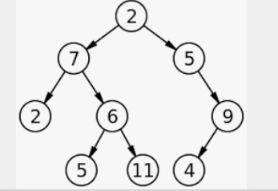
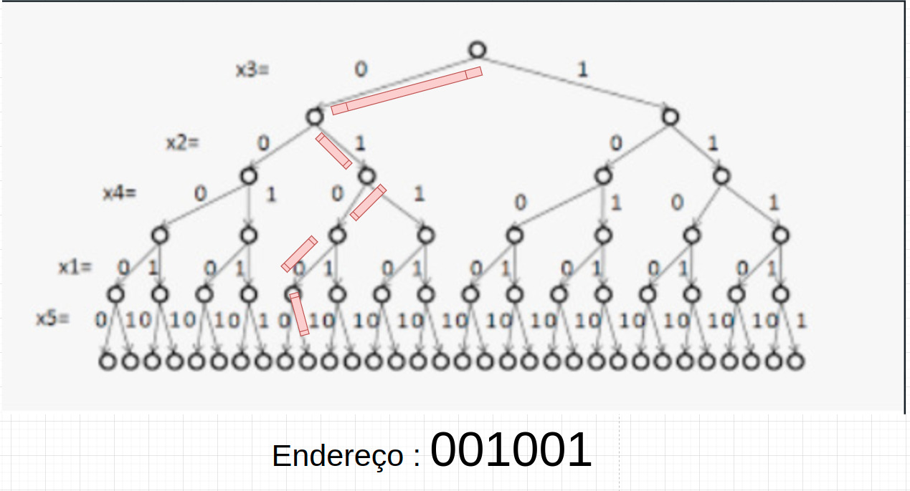

# AccountVAX

* Kant (Moval, Valor moral)
* Markes (as pessoas tem que lutar pela sobrevivencia "trabalho") (Culpa é do captalismo) [Captalismo seuvagem]
* Russo (o homer nasce bom, a sociedade faz com que ele se transforme) [O meio pode transformar uma pessoa corrupto] [o Homem que nasce fera sente a necessidade de ser fera]
* Texto Justiça (pequeno discionário das grandes virtudes) 

## Index

- [Tema](#tema)
- [Problema
- [Hipótese
- [Objetivo
- [Introdução
- [Fraude
    - [O que é?
    - [Quais tipos existem?
    - [Como geralmente acontece?
    - [Como evitar?
- [Corrupção
    - [O que é?
    - [O que leva uma pessoa a corrupção?
    - [Quais incentivos o meio proporciona para a corrupção?
    - [Quais são os efeitos da corrupção? (ela pode afetar a mesada do seu filho)
    - [Quais são os efeitos da corrupção em uma empresa?
- [Por que fraudes e corrupções geram improdutividade em um ecossistema ou empresa?
- [Por que caixa 2 afeta as decisões de uma companhia?
- [Quais são as ferramentas que um Investidor tem a fim de identificar Corrupções e Fraudes em uma empresa?
- [O que é uma empresa e qual correlação ela pode se encaixar? (correlação da empresa como um corpo animal e correlação entre a estrutura corporal com os departamentos dentro de uma empresa)
- [Como funciona o processo de pagamento de uma empresa?
- [Como funciona o processo de aprovação orçamentária de um projeto dentro de uma empresa?

- [Revivendo a História? (revendo alguns casos de fraude descobertas em empresas e o que poderia ter sido feito a fim de minimizar essa possibilidade)
    - [Casos de Fraude


- [Solução.
- [Boas práticas.
- [O que é um Controller?
- [Uma breve História da evolução contábil. (Partidas dobradas / Tempos modernos / Blockchain)
- [Blockchain e a nova forma de construir uma !!aplicação!! Descentralizada. 
- [Vantagens e desvantagens de um sistema Descentralizado.
- [O que é mais rápido, uma decisão Centralizada ou Descentralizada?
    - [Centralizada sempre será mais rápida. (abandono da democracia para a agilidade nas decisões)
- [Porque não era possível a criação de um Banco de dados descentralizado.!!
- [O que a Blockchain poderá ajudar na questão de Fraudes / Corrupções e Consenso.

- [Capitulo Entendendo a Blockchain](#capitulo-entendendo-a-blockchain)

    - [O que é](#o-que-é)
    - [Por que antigamente não era possivel revolver o : O problema dos generais bizantinos (PGB)](#tema)
    - [Elementos essenciais de um blockchain](#tema)
    - [Operadores do Banco de dados que o blockchain possui.](#tema)
    - [Nodos (integrantes da rede, micro servidor com todos os dados do banco)](#tema)
    - [Endereço ou chave pública](#tema)
    - [Chave privada ou senha](#tema)
    - [Token](#tema)
    - [Criptografia](#tema)
    - [Função hash criptográfica](#tema)
    - [Timestamp](#tema)
    - [Distributed Ledger Technology](#tema)
    - [Nodos completos](#tema)
    - [Principal mecanismos de prevenção de falhas Bizantina](#tema)
    - [Mapas de uma Blockchain](#tema)
    - [O que é uma Merkle Tree ?](#tema)
    - [Como Esse banco de dados se Indexa (semelhante a uma arvore binária)](#tema)
    - [Endereço de uma Arvore Binária](#tema)


- [Canal de Transparência e comunicação com o investidor.
    - [Se o investidor da sua empresa te perguntasse se o patrimônio dele está sendo bem aplicado, o que você responderia? (Time [de desenvolviemento de Sof , .....)
- [Sistema de voto afim de colher a opinião de um determinado público.
- [Impossibilidade de se resolver um problema complexo como Corrupção, apenas tomando soluções de software.
    - [Auditoria, grande aliado e prevenção de Fraude e Corrupção.
    - [Como funciona um processo de auditoria?
    - [A melhor solução é não ter um ambiente propício a Fraude e Corrupção, será que você está em um Sistema que incentiva a corrupção? 
    - [Como identificar um Sistema onde os integrantes são incentivados a corrupçao?
- [Porque uma decisão baseada em informação descentralizada, tende a ser mais eficiente do que uma decisão Monocratica.
    - [Ex: quantas bolas tem dentro de um frasco (normalmente a média dos chutes é o chute que mais se aproxima da realidade)
- [Por que as metodologias ágeis se destacam das outras? !!!
    - [Um ambiente livre e com alta taxa de autonomia, é mais fértil que um sistema fechado e com baixo nivel de autonomia?
    - [Cadê o Gerente de Projeto? 
    - [Por que um time ágil não precisa de um Gerente de Projeto?
    - [Por que as descições descentralizadas, tomadas pelo time como um todo, tende a ser melhores que uma decisão Top Down?
    - [Por que o empresário / Controller / investidor deveriam ouvir mais seus times a fim de tomarem melhores decisões?


## Tema

Corrupção / Fraude e Auditoria de processos, relacionado com Blockchain.

## Problema

Fraude e Corrupção nas empresas, como uma solução em Blockchain ajudaria ao investidor ter mais segurança no seu investimento utilizando a informação descentralizada e um sistema de coleta de opniões.

## Hipótese

* Será que o investidor gostaria de ter um canal de comunicação direto com o time Operacional da empresa?
* Essa comunicação poderia ser anônima na parte da responta do Funcionário?
* Essa comunicação poderia ser limitada afim de impedir vazamento de informação?
* Essa comunicação poderia funcionar como um canal de votação?
* Será que um Controller poderia tambem utilizar essa opnião para realizar o corte de gastos de forma mais eficiente?
* Será que essas informações seriam uteis para mais algum agente relacionado aos interesses da empresa, como Presidentes e CEOs?
* Será que, ferramentas, processos e insentivos corretos melhoram a produtividade de uma comunicade empresarial?
* Se eu aumentar o nivel de confiança entre elementos de um ecossistema empresarial isso aumentará a produtividade?
* Uma ferramenta eficiente, capas de colher o consenso de um grupo, poderia ser usada de forma que aumentasse a produtividade da empresa?
* Um ecossistema empresarial livre de CORRUPÇÕES ou FRAUDES e com um Alto nivel de confiança entre os INDIVÍDUOS 
teria mais probabilidade de ser mais eficiente do que 
um ecossistema empresarial CORRUPTO e com um baixo nivel de confiança entre os INDIVIDUOS?

* Um investidor teria mais segurança e confiança em uma empresa que toma suas descições de investimentos (como compra de tecnologias, licenças, maquinários e treinamentos) caso essas descições fossem levado em conta a opnião de seus funcionários?

* A partir desse novo modo de descição o investidor teria mais segurança para investir mais dinheiro na empresa?

Essa ultima Hipótese é que visamos focar nesse projeto.

## Objetivo

Entender a partir de uma pequena amostra de problemas relacionados a Fraudes Financeiras (Foi usado o termo pequena apostra pois entendemos que problemas relacionados a fraudes financeiras, são demasiadamente complexos e que requerem entendimento e coleta de diversas variáveis correspondentes ao contexto e falhas no processo Sistemico e Manual, a fim de permitir a Fraude ou CORRUPÇÃO).

O objetivo desse Projeto será mostrar como a tecnologia Blockchain poderia resolver um problema básico de fraudes.

Nossa abordagem, de maneira alguma pretende resolver por completo a questão de CORRUPÇÃO em uma empresa. Mas pretendemos trazer um sistema de consenso e um canal de comunicação do Investidor com os Times que atuam na empresa.

Entendemos que quando uma Empresa está usufruindo do dinheiro dos investidores, pouco se leva em considereção a opinião dos times que sofrerão esse investimento.

Me refiro a investimento no sentido de:

- Como compra de tecnologias.
- Compra de licenças.
- Compra de maquinários.
- Compra de treinamentos.

## Introdução

A entrega final desse projeto será a criação de insumos, dados e informações, para a consepção de um canal de imprensa baseado em votações e avaliações objetivas.

Que terá como principal finalidade aumentar o grau de confiabilidade dos investidos referente a empresa.

Um canal de comunicação onde será regido pelos seguintes aspectos:

- Anonimidade.
- Garantias antifraude.
- Não obrigatoriedade do voto.
- Transparência.
- Criação de Mentalidade anticorrupção.
- Aumentar a confiabilidade entre os elementos do sistema.

Uma ferramenta de comunicação do investidor com as "Squads da empresa".

Uma ferramenta que visa colher a opinião do time referente a decisões correspondentes a investimentos.

Através de políticas transparentes de votação ou avaliação, o investidor poderia se comunicar com os times da empresa afim de entender o que está acontecendo sob a óticas das pessoas que lá trabalham.

Essa pesquisa visa também responder:

Será que eu como investidor teria a decisão de investir mais dinheiro em uma empresa, onde as decisões de investimento dela tivesse como a opinião dos funcionários que trabalham lá uma opinião que é considerada?

Você empresário, possui o Direito monocrático a tomar a Decisão que achar melhor para a sua empresa. Ferir esses direitos causaria o rompimento de toda a nossa Sociedade, por isso os Empresários sempre têm que ter o poder de tomada dessa Decisão.

## Como funciona o processo de aprovação de projetos em uma Companhia?

??????????????????????

## Artefatos

Esse projeto visa entregar os seguintes

1. Dissertação - Onde levantamos alguns aspectos e argumentos correlacionados a:

Aspectos: Socioeconômicos

    * Ética
    * Corrupção
    * Sociedade
    * Política
    * Comportamento
    * Meios de produção 
    * Liberdade
    * Autonomia

Aspectos: Financeiros e Contábeis

    * Controladoria
    * Finanças
    * Corte de gastos
    * Auditoria
    * Travas antifraude
    * Risco do investimento
    * Escola Austríaca Economia

Aspectos: Tecnologia da informação, Criptografia, Validadores

    * Blockchais
    * Comunicação P2P
    * Fluxos de aprovação para transações monetárias

2. Projeto de Software - A fim de implementar materialmente os requisitos dessa Solução.


## O que é um Controller?


## Qual é a relação de uma empresa com a Anatomia de um mamífero?

Controllers: São os anticorpos, São os elementos que mantem a saúde do corpo. Uma das linhas de defeza do corpo, contra Virus, Parazitas ou Bactérias. Agente que impede a morte Financeira do corpo (no nosso caso Empresa).

Times de produção, pesquisa e desenvolvimento: são os pulmões, coração, ossos e músculos. São os que fazem o corpo (ou empresa) se mover.

Presidentes / Diretores / Heads / Gestores / Coordenadores: São o cérebro e sistema nevorso do corpo. São os agentes que estimulam a motivação intrínseca.

Investidores, Clientes e Ativos: São os agentes que dão vida ao Ecossistema. Na nossa analogia eles seriam o ar, a água e o alimento que mantem o corpo vivo.

Vírus, Parazitas ou Bactérias: São elementos que atuam causando uma desfunção no bom funcionamento do corpo. São os elementos que tornam esse corpo improdutivo e infertil para a Vida (me refiro vida como se fosse a capacidade produtiva do corpo, bom funcionamento de todos os orgãos) são:

    * Investimentos feitos de forma mal planejada.
    * Investimentos com baixas chances de serem concluídos.
    * Investimentos que são maiores que as necessidades da empresa.
    * Grupo de pessoas que formam um cartel na empresa.
    * Grupo de pessoas e individuos que atrapalham a produtividade da empresa.
    * Adquirir uma tecnologia, onde o time não tem capacidade de sustentá-la. (provavelemente você terá mais gastos)
    * Caixa 2
        - Contratação de empresas para caixa 2.
        - Contratação de produtos para caixa 2.
        - Contratos desvantajoços e improdutivos, visando caixa 2
    * Estímulos que proporcionam corrupção.
        - 
        -
        -

Caso você seja um investidor e você tivesse um certificado, onde garantisse que aos mesmos os times de "Produção" foram ouvidos referente a descição sobre algum investimento, você ficaria mais seguro? Você seria capaz de investir mais dinheiro em uma empresa ao saber que ela leva em consideração a opinião de seu "pulmão / coração / ossos / nusculos"?

Será que o investidor gostaria de ter um canal de comunicação direto com o time Operacional da empresa?

Será que um Controller poderia tambem utilizar essa opnião para realizar o corte de gastos?

## O que acontece com uma empresa quando é descoberta uma fraude financeira?

## Por que uma fraude é ruim para uma empresa?

## Somos corruptos pois somos estimulados à corrupção? Estamos em um ambiente onde recebemos estimulos à corrupção?

## O que são Bancos de Dados descentralizados?

## O que é blockchain?

## O que é Sistema de concenço e por que a tecnologia Blockchain é tão segura?

## O que esse projeto é para: O INVESTIDOR

Um canal de comunicação e transparência.
Um selo de qualidade referente a tomada de decisões de forma não 100% centralizada.

## O que esse projeto é para: DONO DA EMPRESA

Uma ferramenta que poderá mostrar de forma clara a opnião objetiva dos seus colaboradores. Porém não irá interferir nas decisões monocráticas do Dono da Empresa.

## O que esse projeto é para: OS COLABORADORESO

Uma ferramenta motivacional onde o colaborador tem participação ativa nas decisões da empresa.

## O que esse projeto é para: PARA A SOCIEDADE

Uma ferramenta que visa melhorar a questão da corrupção para ecossistemas empresariais

## Conceito de Anonimato?

    - Formas de anonimato?

    - Incapacidade de ligar A pessoa com a Ação.

## Evoluções Contábeis históricas

* Partidas dobradas
* ....
* ....
* ....
* Blockchain

## Decisões Monocráticas, Centralização e necessidade de 

Acho que todo empresário tem que ter a autonimia MONOCRÁTICA de fazer o que deseja com o seu patrimônio e sua empresa.

Não acho possível uma sociedade produtiva onde não é respeitada a propriedade privada.

Porém quando falamos de investidor / capital extrangeiro / IPO ou qualquer outra forma de recolhimento de capital externo, pecamos muito em relação a transparência e descição objetiva para o que fazer com o capital extra que entrou na empresa.

## Por que consultar os times pode ser uma boa ideia?

Muitas companhias possuem um Comitê de investimento e um "Rigoroso" processo de aprovação de verba. Fato interessante desse Comitê de investimento é que muito se sabe sobre o Mercado / Tendências Globais / Previsões de flutuações em nichos de mercado e qualquer outro dado externo que poderia afetar a companhia. Em contrapartida, entende-se muito pouco sobre as reais necessidades operacionais e gargalos enfrentados pela linha produtiva.

Certa vez, um ex-gerente meu passou por um problema, onde tinha que envolver uma área fora de sua gestão.
No mesmo momento o Gerente dessa outra área foi acionado e nada foi resolvido.

Em um outro momento passamos pelo mesmo problema.
Dessa vez acionamos o Desenvolvedor da área. O problema foi esclarecido e solucionado.

Entenda que o que quero expor não foi nesse caso a ineficiência do Gerente e nem mesmo a promoção do Desenvolvedor. O que quero chamar a atenção, é que o propulsor produtivo e agente eficiente e adaptado para a solução do problema nesse caso é o Desenvolvedor.

Em melhores palavras, eu gerente, atuante nesse Corpo como cèrebro e sistema nevorso, nunca serei tão eficiente para bombear sanque, quanto o coração.

Se realmente encaramos os "Times de produção, pesquisa e desenvolvimento" como o pulmôes, coração, ossos, e músculos será que não seria interessante saber ao menos a opnião dos integrantes desse time, qual tipo de investimento seria interessante fazer visando o aumento da performance no time?

## Por que consultar os times pode não ser uma boa ideia?

..........

## Essa pesquisa visa também entender e mostrar que Decisões Descentralizadas geralmente são mais eficientes que Decisões Centralizadas porém é adicionado o tempo gasto para se atingir o Consenso.


## Problema de incentivos errados na economia

    Por que a intervenção do estado tende a aumentar o problema na economia?

    Citar exemplos históricos

    * Casos de congelamento de preços (problema na India: Garantir o preço independente da produtividade)
    * Congelamento de patrimônio
    * Limite de saques diários
    * Hiperinflação
    *

## Por que uma decição baseada em informação descentralizada, sempre será mais eficiente do que uma decição Monocratica?

https://www.youtube.com/watch?v=Vq1MjgGoVpQ&t=197s

## Cuidado com os incentivos que a Empresa dá aos seus funcionários

## Capitulo Entendendo a Blockchain

## O que é 

Mas quais são os elementos essenciais de um blockchain que possibilitam a resolução do Dilema dos Generais Bizantinos e viabilizam essa inovação? Elementos básicos dos blockchains" (from "Blockchain e Organizações Descentralizadas" by João Guilherme Lyra)

## Por que antigamente não era possivel revolver o : O problema dos generais bizantinos (PGB)

O problema dos generais bizantinos (PGB)

    - Vários generais do mesmo lado e seus exércitos estão localizados em diferentes extremos de uma cidade com a intenção de cercá-la.
    - Para ter sucesso, eles precisam atacar a cidade de maneira coordenada para derrotar as defesas ou recuar de forma coordenada. No caso de não sincronizar suas ações, eles cairão diante das fortes forças inimigas.
    - Para conseguir isso, os generais atacantes se comunicam através de mensageiros.
    - Embora a cidade esteja cheia de inimigos, os mensageiros devem atravessar a cidade para ir de um acampamento para outro com ordens de ataque.
    - A suposição indica que um mensageiro do exército informará outro da intenção de atacar ou não, e quando fazê-lo.
    - À medida que recebem propostas, os generais os confirmam ou os rejeitam para estabelecer um acordo de votação sobre qual passo dar.


> Link de referencia: Falha Bizantina : https://academy.bit2me.com/pt/que-es-falla-bizantina/


Como você pode ver, o problema é que dentro da cidade inimigos poderiam capturar mensageiros. Se eles puderem ser interceptados, a mensagem pode ser modificado e, conseqüentemente, o ataque não seria realizado de maneira coordenada. Se não fossem executados de maneira coordenada, os exércitos atacantes seriam derrotados, fracassando em sua missão.

Por exemplo, se uma mensagem dos generais fosse "Ataque amanhã", O texto pode ser alterado adicionando" somente se chover "atrás. Desta forma, o outro exército pode pensar que está concordando em atacar apenas em caso de chuva, e confirmar a mensagem. Assim, o primeiro exército atacaria e o segundo não poderia e se retiraria se não chovesse.

Num conjunto de sistemas de computadores distribuídos com um objetivo comum, cada computador seria equivalente a um general e seu exército. E, portanto, a rede de dados seria análoga aos mensageiros que devem atravessar a cidade informando os generais.

## Elementos essenciais de um blockchain

"Mas quais são os elementos essenciais de um blockchain que possibilitam a resolução do Dilema dos Generais Bizantinos e viabilizam essa inovação? Elementos básicos dos blockchains" (from "Blockchain e Organizações Descentralizadas" by João Guilherme Lyra)

## Operadores do Banco de dados que o blockchain possui.

Escrita e Leitura.

Por ser um banco de dados que representa um livro razão, você não tem permissão para alterar ou deletar dados.

Caso o tente, os mecanismos da Blockchain irá barrar essa ação, pois ficará claro que você está tentando burlar o banco de dados.

## Nodos (integrantes da rede, micro servidor com todos os dados do banco)

"Rede e nodos Uma rede ponto a ponto (peer-to-peer) propaga transações e blocos para cada nó de bitcoin na rede. Existem alguns tipos de nodos em uma rede: carteira, minerador, nodo completo e roteador da rede. Todos os nodos incluem a função de roteamento para participar na rede e podem incluir outras funcionalidades (ANTONOPOULOS, 2014)." (from "Blockchain e Organizações Descentralizadas" by João Guilherme Lyra)

## Endereço ou chave pública

"Endereço ou chave pública Um endereço em um blockchain é semelhante a um e-mail, no qual se pode enviar e receber de outras pessoas as unidades de troca daquele bloco. O endereço da rede blockchain é criptografado e, ao se criar um endereço, simultaneamente é criada uma chave privada ou senha (ibid.). A interface com o endereço é realizada pelas carteiras. Um endereço de uma rede blockchain se parece com: 3JowMKcM3R3ErnNLW4XT2sjs6tGzpwRzgd" (from "Blockchain e Organizações Descentralizadas" by João Guilherme Lyra)

## Chave privada ou senha

Chave privada ou senha É a única forma de acesso para destravar os tokens e enviar para um determinado endereço. Se houver perda dessa chave, não há como mover os tokens desse endereço (ibid). Uma chave privada se parece com: 7R46xG3L6jTyzE96r66Sg3xka6y46whpJjMwCxR3tzLh3fbVOtu" (from "Blockchain e Organizações Descentralizadas" by João Guilherme Lyra)

## Token

Token Unidade de troca de uma cadeia de blocos que pode assumir diferentes funções: votos, registros, atestado, utilitário, direito de propriedade, ativos, currency e identidades (ANTONOPOULOS; WOOD, 2018). Muitas vezes um token assume mais de uma dessas funcionalidades e é chamado de híbrido." (from "Blockchain e Organizações Descentralizadas" by João Guilherme Lyra)

## Criptografia

Criptografia As informações em um blockchain só podem ser compartilhadas de forma pública graças à criptografia utilizada. A maioria das cadeias de blocos usa curvas elípticas em sua criptografia. A criptografia das transações de bitcoins utiliza o modelo de curvas elípticas, sendo assimétricas, baseadas em logaritmos discretos expressados pela adição e multiplicação nos pontos de uma curva elíptica. Essas funções matemáticas não podem ser derivadas. São funções que podem produzir novos resultados, mas não voltam ao resultado anterior. Simplificando a ideia, os cálculos só andam para frente e formam uma cadeia crescente de registros (ANTONOPOULOS, 2014)." (from "Blockchain e Organizações Descentralizadas" by João Guilherme Lyra)

## Função hash criptográfica

Função hash criptográfica Uma função hash criptográfica é uma função unidirecional que mapeia dados de tamanho arbitrário para uma cadeia de bits de tamanho fixo." (from "Blockchain e Organizações Descentralizadas" by João Guilherme Lyra)

## Timestamp 

Timestamp (carimbo de tempo) Um servidor de carimbo de tempo adiciona às hashes a hora e data, publicando amplamente a informação assim como em um jornal. O carimbo de tempo prova que os dados precisam obviamente ter existido naquele momento para que sejam incluídos na hash. Cada carimbo de tempo inclui o carimbo de tempo anterior em sua hash, formando uma corrente, com cada carimbo de tempo adicional reforçando os anteriores (NAKAMOTO, 2008).

## Distributed Ledger Technology

A tecnologia blockchain também é conhecida como DLT (Distributed Ledger Technology). Ledgers, segundo o dicionário Cambridge, é um livro no qual as coisas são registradas regularmente, especialmente atividades financeiras de dinheiro recebido ou pago. Em português, uma adequada tradução seria “livro-razão”, onde são lançadas as entradas e saídas contábeis." (from "Blockchain e Organizações Descentralizadas" by João Guilherme Lyra)

## Nodos completos 

Nodos completos podem verificar de maneira autônoma e autoritária qualquer transação sem referência externa (ANTONOPOULOS, 2014)." (from "Blockchain e Organizações Descentralizadas" by João Guilherme Lyra)

## Principal mecanismos de prevenção de falhas Bizantina

As transações que não forem reconhecidas pelos ledgers dos usuários do bloco não são válidas (MEIKLEJOHN et al., 2016). Uma vez que um nodo recebe dados de outro nodo, ele verifica a autenticação dos dados em seu próprio ledger." (from "Blockchain e Organizações Descentralizadas" by João Guilherme Lyra)


## Mapas de uma Blockchain

> Blockchain jull


> Zoom na Merkle Tree





## O que é uma Merkle Tree ?

Merkel Tree é a forma que a Blockchain usa para salvar e indexar os dados, no caso o banco não precisa de um reindex pois ele já salva os dados indexados.

## Como Esse banco de dados se Indexa (semelhante a uma arvore binária)




## Endereço de uma Arvore Binária



> Qual é o Endereço : 001001 ?


> É esse.



## Política de corte de Gastos (cuidado com a economia burra e investimentos incapazes de ser concluídos)

## Quais são os critérios saudáveis para o corte de gastos?

## Eficiência de um time referente a investimento de novas tecnologias.

Se o seu time precisa de um fornecedor especializado para te dar suporte ao aplicar ou até mesmo experimentar uma solução Open Source, talvez o seu time precise rever as suas capacidades técnicas. Ou talvez o seu problema seja realmente complexo.

## Formas de aumentar a produtividade de um time.

    Times com autonomia e livres para atender a solução de um problema, tendem a ser mais produtivos.


## Links

Arquitetura P2P: https://www.youtube.com/watch?v=LiOZcck8dfU

P2Ps Escrow Service Work : https://www.binance.com/en/blog/all/how-does-binance-p2ps-escrow-service-work-421499824684900825

Link plataforma: https://www.kaleido.io/

Link de video mostrando como utilizar: https://www.youtube.com/watch?v=2XzxdlqN0ks&ab_channel=Kaleido

Documentação firefly: https://github.com/hyperledger/firefly
 
AML : https://www.sec.gov/about/offices/ocie/amlsourcetool.htm

Bitcoin Escrow Script: https://www.youtube.com/watch?v=hljavgPb6Yw

What is Escrow: https://www.youtube.com/watch?v=Xt5pUmeicqo

Escrow : https://www.youtube.com/watch?v=jBIfyVFMoHc

Smart Contract : https://www.youtube.com/watch?v=ooN6kZ9vqNQ

Curso de Blockchain para Negócios: aplicações e cases reais : https://cursos.alura.com.br/course/blockchain-para-negocios

Curso de Blockchain: aumente a confiança da sua aplicação : https://cursos.alura.com.br/course/blockchain-confianca-da-sua-aplicacao

Exemplo de Incentivos errados que possibilitam a corrupção : https://www.youtube.com/watch?v=Vq1MjgGoVpQ&t=197s

Falha Bizantina : https://academy.bit2me.com/pt/que-es-falla-bizantina/

## Videos

Bitcoin na Lua : https://www.youtube.com/watch?v=JJ2k1XWSfd4

Real Digital : https://www.youtube.com/watch?v=bPwH2sJFGfs

Origem do Livro razão : https://www.youtube.com/watch?v=twwWRthJ_C0

Nova ordem mundial : https://www.youtube.com/watch?v=6cn3jKySrFU&t=68s

Pais ANCAP : https://www.youtube.com/watch?v=iF9jaN3LHMo

Insentivos errados : https://www.youtube.com/watch?v=Jv1kjhZSXsE

Economia Argentina : https://www.youtube.com/watch?v=L_TZJfCn7_I

Metrô do Rio: Um exemplo clássico de ineficiência estatal : https://www.youtube.com/watch?v=nzyjBMxtzrY

O que é Economia : https://www.youtube.com/watch?v=5vCOhPrlRUs

Progamação linear : https://www.youtube.com/watch?v=iljf9W2__uo&t=976s

"A lei frequentemente destrói o que deveria preservar" : https://www.youtube.com/watch?v=6tsNkKXvu84&t=378s

Incentivos errados : https://www.youtube.com/watch?v=Vq1MjgGoVpQ&t=197s

Moral e Ética : https://www.youtube.com/watch?v=ufTPyv8nTq4&ab_channel=Document%C3%A1rios10

## FireFly Core code hierarchy

```
┌──────────┐  ┌───────────────┐
│ cmd      ├──┤ firefly   [Ff]│  - CLI entry point
└──────────┘  │               │  - Creates parent context
              │               │  - Signal handling
              └─────┬─────────┘
                    │
┌──────────┐  ┌─────┴─────────┐  - HTTP listener (Gorilla mux)
│ internal ├──┤ api       [As]│    * TLS (SSL), CORS configuration etc.
└──────────┘  │ server        │    * WS upgrade on same port
              │               │  - REST route definitions
              └─────┬─────────┘    * Simple routing logic only, all processing deferred to orchestrator
                    │
              ┌─────┴─────────┐  - REST route definition framework
              │ openapi   [Oa]│    * Standardizes Body, Path, Query, Filter semantics
              │ spec          |      - OpenAPI 3.0 (Swagger) generation
              └─────┬─────────┘    * Including Swagger. UI
                    │
              ┌─────┴─────────┐  - WebSocket server
              │           [Ws]│    * Developer friendly JSON based protocol business app development
              │ websockets    │    * Reliable sequenced delivery
              └─────┬─────────┘    * _Event interface [Ei] supports lower level integration with other compute frameworks/transports_
                    │
              ┌─────┴─────────┐  - Extension point interface to listen for database change events
              │ admin     [Ae]│    * For building microservice extensions to the core that run externally
              │ events        |    * Used by the Transaction Manager component
              └─────┬─────────┘    * Filtering to specific object types
                    │
              ┌─────┴─────────┐  - Core data types
              │ fftypes   [Ft]│    * Used for API and Serialization
              │               │    * APIs can mask fields on input via router definition
              └─────┬─────────┘
                    │
              ┌─────┴─────────┐  - Core runtime server. Initializes and owns instances of:
              │           [Or]│    * Components: Implement features
  ┌───────┬───┤ orchestrator  │    * Plugins:    Pluggable infrastructure services
  │       │   │               │  - Exposes actions to router
  │       │   └───────────────┘    * Processing starts here for all API calls
  │       │
  │  Components: Components do the heavy lifting within the engine
  │       │
  │       │   ┌───────────────┐  - Integrates with Blockchain Smart Contract logic across blockchain technologies
  │       ├───┤ contract  [Cm]│    * Generates OpenAPI 3 / Swagger definitions for smart contracts, and propagates to network
  │       │   │ manager       │    * Manages listeners for native Blockchain events, and routes those to application events
  │       │   └───────────────┘    * Convert to/from native Blockchain interfaces (ABI etc.) and FireFly Interface [FFI] format
  │       │
  │       │   ┌───────────────┐  - Maintains a view of the entire network
  │       ├───┤ network   [Nm]│    * Integrates with network permissioning [NP] plugin
  │       │   │ map           │    * Integrates with broadcast plugin
  │       │   └───────────────┘    * Handles hierarchy of member identity, node identity and signing identity
  │       │
  │       │   ┌───────────────┐  - Broadcast of data to all parties in the network
  │       ├───┤ broadcast [Bm]│    * Implements dispatcher for batch component
  │       │   │ manager       |    * Integrates with shared storage interface [Ss] plugin
  │       │   └───────────────┘    * Integrates with blockchain interface [Bi] plugin
  │       │
  │       │   ┌───────────────┐  - Send private data to individual parties in the network
  │       ├───┤ private   [Pm]│    * Implements dispatcher for batch component
  │       │   │ messaging     |    * Integrates with the data exchange [Dx] plugin
  │       │   └──────┬────────┘    * Messages can be pinned and sequenced via the blockchain, or just sent
  │       │          │
  │       │   ┌──────┴────────┐  - Groups of parties, with isolated data and/or blockchains
  │       │   │ group     [Gm]│    * Integrates with data exchange [Dx] plugin
  │       │   │ manager       │    * Integrates with blockchain interface [Bi] plugin
  │       │   └───────────────┘
  │       │
  │       │   ┌───────────────┐  - Private data management and validation
  │       ├───┤ data      [Dm]│    * Implements dispatcher for batch component
  │       │   │ manager       │    * Integrates with data exchange [Dx] plugin
  │       │   └──────┬────────┘    * Integrates with blockchain interface [Bi] plugin
  │       │          │
  │       │   ┌──────┴────────┐  - JSON data schema management and validation (architecture extensible to XML and more)
  │       │   │ json      [Jv]│    * JSON Schema validation logic for outbound and inbound messages
  │       │   │ validator     │    * Schema propagation
  │       │   └──────┬────────┘    * Integrates with broadcast plugin
  │       │          │
  │       │   ┌──────┴────────┐  - Binary data addressable via ID or Hash
  │       │   │ blobstore [Bs]│    * Integrates with data exchange [Dx] plugin
  │       │   │               │    * Hashes data, and maintains mapping to payload references in blob storage
  │       │   └───────────────┘    * Integrates with blockchain interface [Bi] plugin
  │       │
  │       │   ┌───────────────┐  - Download from shared storage
  │       ├───┤ shared    [Sd]│    * Parallel asynchronous download
  │       │   │ download      │    * Resilient retry and crash recovery
  │       │   └───────────────┘    * Notification to event aggregator on completion
  │       │
  │       │   ┌───────────────┐
  │       ├───┤ identity [Im] │  - Central identity management service across components
  │       │   │ manager       │    * Resolves API input identity + key combos (short names, formatting etc.)
  │       │   │               │    * Resolves registered on-chain signing keys back to identities
  │       │   └───────────────┘    * Integrates with Blockchain Interface and pluggable Identity Interface (TBD)
  │       │
  │       │   ┌───────────────┐  - Keeps track of all operations performed against external components via plugins
  │       ├───┤ operation [Om]│    * Updates database with inputs/outputs
  │       │   │ manager       │    * Provides consistent retry semantics across plugins
  │       │   └───────────────┘
  │       │
  │       │   ┌───────────────┐  - Private data management and validation
  │       ├───┤ event     [Em]│    * Implements dispatcher for batch component
  │       │   │ manager       │    * Integrates with data exchange [Dx] plugin
  │       │   └──────┬────────┘    * Integrates with blockchain interface [Bi] plugin
  │       │          │
  │       │   ┌──────┴────────┐  - Handles incoming external data
  │       │   │           [Ag]│    * Integrates with data exchange [Dx] plugin
  │       │   │ aggregator    │    * Integrates with shared storage interface [Ss] plugin
  │       │   │               │    * Integrates with blockchain interface [Bi] plugin
  │       │   │               │  - Ensures valid events are dispatched only once all data is available
  │       │   └──────┬────────┘    * Context aware, to prevent block-the-world scenarios
  │       │          │
  │       │   ┌──────┴────────┐  - Subscription manager
  │       │   │           [Sm]│    * Creation and management of subscriptions
  │       │   │ subscription  │    * Creation and management of subscriptions
  │       │   │ manager       │    * Message to Event matching logic
  │       │   └──────┬────────┘
  │       │          │
  │       │   ┌──────┴────────┐  - Manages delivery of events to connected applications
  │       │   │ event     [Ed]│    * Integrates with data exchange [Dx] plugin
  │       │   │ dispatcher    │    * Integrates with blockchain interface [Bi] plugin
  │       │   └───────────────┘
  │       │
  │       │   ┌───────────────┐  - Token creation/transfer initiation, indexing and coordination
  │       ├───┤ asset     [Am]│    * Fungible tokens: Digitized value/settlement (coins)
  │       │   │ manager       │    * Non-fungible tokens: NFTs / globally uniqueness / digital twins
  │       │   └───────────────┘    * Full indexing of transaction history
  │       │   [REST/WebSockets]
  │       │   ┌─────┴─────────────┐   ┌──────────┐   ┌─ 
  │       │   │ ERC-20 / ERC-721  ├───┤ ERC-1155 ├───┤  Simple framework for building token connectors
  │       │   └───────────────────┘   └──────────┘   └─ 
  │       │
  │       │   ┌───────────────┐
  │       ├───┤ sync /   [Sa] │  - Sync/Async Bridge
  │       │   │ async bridge  │    * Provides synchronous request/reply APIs
  │       │   │               │    * Translates to underlying event-driven API
  │       │   └───────────────┘
  │       │
  │       │   ┌───────────────┐  - Aggregates messages and data, with rolled up hashes for pinning
  │       ├───┤ batch     [Ba]│    * Pluggable dispatchers
  │       │   │ manager       │  - Database decoupled from main-line API processing
  │       │   │               │    * See architecture diagrams for more info on active/active sequencing
  │       │   └──────┬────────┘  - Manages creation of batch processor instances
  │       │          │
  │       │   ┌──────┴────────┐  - Short lived agent spun up to assemble batches on demand
  │       │   │ batch     [Bp]│    * Coupled to an author+type of messages
  │       │   │ processor     │  - Builds batches of 100s messages for efficient pinning
  │       │   │               │    * Aggregates messages and data, with rolled up hashes for pinning
  │       │   └───────────────┘  - Shuts down automatically after a configurable inactivity period
  │       ... more TBD
  │
Plugins: Each plugin comprises a Go shim, plus a remote agent microservice runtime (if required)
  │
  │           ┌───────────────┐  - Blockchain Interface
  ├───────────┤           [Bi]│    * Transaction submission - including signing key management
  │           │ blockchain    │    * Event listening
  │           │ interface     │    * Standardized operations, and custom on-chain coupling
  │           └─────┬─────────┘
  │                 │
  │                 ├─────────────────────┬───────────────────┐
  │           ┌─────┴─────────┐   ┌───────┴───────┐   ┌───────┴────────┐
  │           │ ethereum      │   │ fabric        │   │ corda/cordapps │
  │           └─────┬─────────┘   └───────────────┘   └────────────────┘
  │           [REST/WebSockets]
  │           ┌─────┴────────────────────┐   ┌────────────────────────┐   ┌─ 
  │           │ transaction manager [Tm] ├───┤ Connector API [ffcapi] ├───┤  Simple framework for building blockchain connectors
  │           └──────────────────────────┘   └────────────────────────┘   └─ 
  │        
  │           ┌───────────────┐  - Token interface
  ├───────────┤ tokens    [Ti]│    * Standardizes core concepts: token pools, transfers, approvals
  │           │ interface     │    * Pluggable across token standards
  │           └───────────────┘    * Supports simple implementation of custom token standards via microservice connector
  │           [REST/WebSockets]
  │           ┌─────┴─────────────┐   ┌──────────┐   ┌─ 
  │           │ ERC-20 / ERC-721  ├───┤ ERC-1155 ├───┤  Simple framework for building token connectors
  │           └───────────────────┘   └──────────┘   └─ 
  │
  │           ┌───────────────┐  - P2P Content Addresssed Filesystem
  ├───────────┤ shared    [Si]│    * Payload upload / download
  │           │ storage       │    * Payload reference management
  │           │ interface     │
  │           └─────┬─────────┘
  │                 │
  │                 ├───────── ... extensible to any shared storage sytem, accessible to all members
  │           ┌─────┴─────────┐
  │           │ ipfs          │
  │           └───────────────┘
  │
  │           ┌───────────────┐  - Private Data Exchange
  ├───────────┤ data      [Dx]│    * Blob storage
  │           │ exchange      │    * Private secure messaging
  │           └─────┬─────────┘    * Secure file transfer
  │                 │
  │                 ├─────────────────────┬────────── ... extensible to any private data exchange tech
  │           ┌─────┴─────────┐   ┌───────┴───────┐
  │           │ https / MTLS  │   │ Kaleido       │
  │           └───────────────┘   └───────────────┘
  │
  │           ┌───────────────┐  - API Authentication and Authorization Interface
  ├───────────┤ api auth  [Aa]│    * Authenticates security credentials (OpenID Connect id token JWTs etc.)
  │           │               │    * Extracts API/user identity (for identity interface to map)
  │           └─────┬─────────┘    * Enforcement point for fine grained API access control
  │                 │
  │                 ├─────────────────────┬────────── ... extensible other single sign-on technologies
  │           ┌─────┴─────────┐   ┌───────┴───────┐
  │           │ apikey        │   │ jwt           │
  │           └───────────────┘   └───────────────┘
  │
  │           ┌───────────────┐  - Database Interactions
  ├───────────┤ database  [Di]│    * Create, Read, Update, Delete (CRUD) actions
  │           │ interace      │    * Filtering and update definition interace
  │           └─────┬─────────┘    * Migrations and Indexes
  │                 │
  │                 ├───────── ... extensible to NoSQL (CouchDB / MongoDB etc.)
  │           ┌─────┴─────────┐
  │           │ sqlcommon     │
  │           └─────┬─────────┘
  │                 ├───────────────────────┬───────── ... extensible other SQL databases
  │           ┌─────┴─────────┐     ┌───────┴────────┐
  │           │ postgres      │     │ sqlite3        │
  │           └───────────────┘     └────────────────┘
  │
  │           ┌───────────────┐  - Connects the core event engine to external frameworks and applications
  ├───────────┤ event     [Ei]│    * Supports long-lived (durable) and ephemeral event subscriptions
  │           │ interface     │    * Batching, filtering, all handled in core prior to transport
  │           └─────┬─────────┘    * Interface supports connect-in (websocket) and connect-out (broker runtime style) plugins
  │                 │
  │                 ├───────────────────────┬──────────   ... extensible to additional event buses (Kafka, NATS, AMQP etc.)
  │           ┌─────┴─────────┐     ┌───────┴────────┐
  │           │ websockets    │     │ webhooks       │
  │           └───────────────┘     └────────────────┘
  │  ... more TBD

  Additional utility framworks
              ┌───────────────┐  - REST API client
              │ rest      [Re]│    * Provides convenience and logging
              │ client        │    * Standardizes auth, config and retry logic
              └───────────────┘    * Built on Resty

              ┌───────────────┐  - WebSocket client
              │ wsclient  [Wc]│    * Provides convenience and logging
              │               │    * Standardizes auth, config and reconnect logic
              └───────────────┘    * Built on Gorilla WebSockets

              ┌───────────────┐  - Translation framework
              │ i18n      [In]│    * Every translations must be added to `en_translations.json` - with an `FF10101` key
              │               │    * Errors are wrapped, providing extra features from the `errors` package (stack etc.)
              └───────────────┘    * Description translations also supported, such as OpenAPI description

              ┌───────────────┐  - Logging framework
              │ log       [Lo]│    * Logging framework (logrus) integrated with context based tagging
              │               │    * Context is used throughout the code to pass API invocation context, and logging context
              └───────────────┘    * Example: Every API call has an ID that can be traced, as well as a timeout

              ┌───────────────┐  - Configuration
              │ config    [Co]│    * File and Environment Variable based logging framework (viper)
              │               │    * Primary config keys all defined centrally
              └───────────────┘    * Plugins integrate by returning their config structure for unmarshaling (JSON tags)

```
